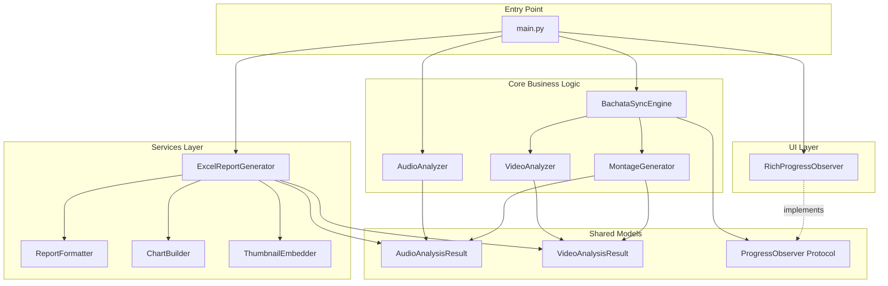
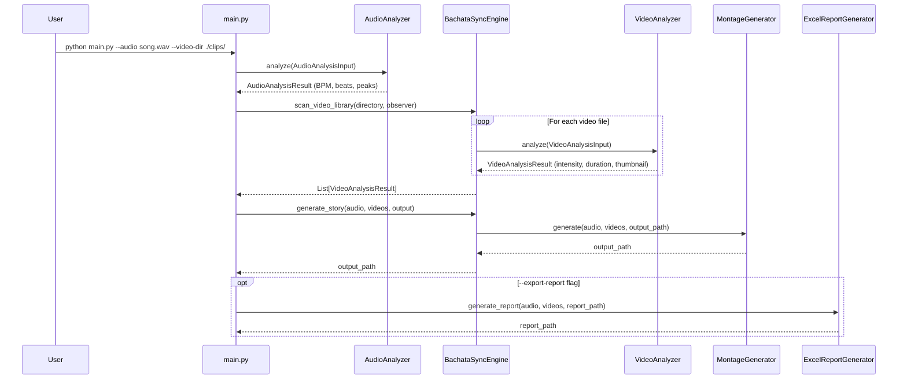
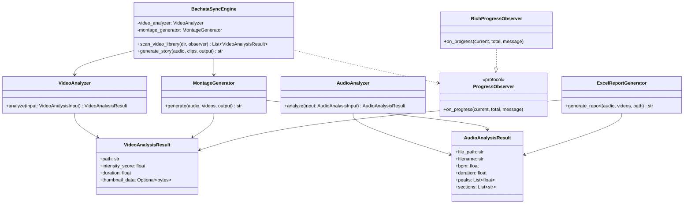

# Architecture Overview — Bachata Beat-Story Sync

> Technical architecture documentation for developers working on or extending the project.

---

## System Overview

Bachata Beat-Story Sync follows a **layered clean architecture** pattern with clear separation between core business logic, services, and UI presentation.



---

## Data Flow Pipeline



---

## Directory Structure

```
bachata-beat-story-sync/
├── main.py                          # CLI entry point
├── Makefile                         # Build automation
├── requirements.txt                 # Python dependencies
├── mypy.ini                         # Type checking config
├── .env.example                     # Environment template
│
├── src/
│   ├── __init__.py
│   ├── core/                        # Core business logic
│   │   ├── __init__.py
│   │   ├── app.py                   # BachataSyncEngine (orchestrator)
│   │   ├── audio_analyzer.py        # Librosa-based audio analysis
│   │   ├── video_analyzer.py        # OpenCV-based video analysis
│   │   ├── montage.py               # MoviePy-based montage generation
│   │   ├── models.py                # Pydantic DTOs
│   │   ├── interfaces.py            # Protocol definitions
│   │   └── validation.py            # Input validation & security
│   │
│   ├── services/                    # External service integrations
│   │   └── reporting/
│   │       ├── __init__.py
│   │       ├── generator.py         # ExcelReportGenerator
│   │       ├── formatting.py        # ReportFormatter (styles)
│   │       └── components.py        # ChartBuilder, ThumbnailEmbedder
│   │
│   └── ui/                          # User interface
│       └── console.py               # RichProgressObserver
│
├── tests/                           # Test suite
│   ├── test_core.py
│   ├── test_core_progress.py
│   ├── test_reporting.py
│   ├── test_reporting_charts.py
│   ├── test_reporting_thumbnails.py
│   ├── test_video_analyzer_security.py
│   ├── test_video_thumbnails.py
│   └── unit/
│       ├── test_audio_analyzer.py
│       ├── test_montage.py
│       ├── test_reporting_formatting.py
│       └── test_video_analyzer.py
│
└── docs/                            # Documentation (you are here)
```

---

## Module Descriptions

### Core Layer (`src/core/`)

| Module | Class | Responsibility |
|--------|-------|---------------|
| `app.py` | `BachataSyncEngine` | Orchestrates the full pipeline: video scanning → story generation |
| `audio_analyzer.py` | `AudioAnalyzer` | Extracts BPM, beats, and onsets from audio using Librosa |
| `video_analyzer.py` | `VideoAnalyzer` | Computes motion-intensity scores and thumbnails using OpenCV |
| `montage.py` | `MontageGenerator` | Concatenates video segments synced to beats using MoviePy |
| `models.py` | `AudioAnalysisResult`, `VideoAnalysisResult` | Pydantic DTOs for inter-layer data transfer |
| `interfaces.py` | `ProgressObserver` | Protocol (structural typing) for progress callbacks |
| `validation.py` | `validate_file_path()` | Shared input validation with security checks |

### Services Layer (`src/services/`)

| Module | Class | Responsibility |
|--------|-------|---------------|
| `generator.py` | `ExcelReportGenerator` | Creates multi-sheet Excel reports from analysis data |
| `formatting.py` | `ReportFormatter` | Applies header styles, column widths, conditional formatting |
| `components.py` | `ChartBuilder`, `ThumbnailEmbedder` | Creates bar charts and embeds thumbnail images |

### UI Layer (`src/ui/`)

| Module | Class | Responsibility |
|--------|-------|---------------|
| `console.py` | `RichProgressObserver` | Rich library progress bar implementing `ProgressObserver` protocol |

---

## Class Diagram



---

## Key Design Patterns

| Pattern | Where Used | Purpose |
|---------|-----------|---------|
| **Observer** | `ProgressObserver` protocol + `RichProgressObserver` | Decouples progress UI from business logic |
| **Strategy** | `AudioAnalyzer` / `VideoAnalyzer` as injectable analyzers | Allows swapping analysis implementations |
| **DTO** | Pydantic `BaseModel` subclasses in `models.py` | Type-safe, validated data transfer between layers |
| **Facade** | `BachataSyncEngine` | Single entry point orchestrating multiple subsystems |
| **Builder** | `ExcelReportGenerator` with `ChartBuilder`, `ReportFormatter` | Separates report construction from presentation |

---

## Technology Stack

| Technology | Version | Purpose |
|------------|---------|---------|
| Python | ≥3.9 | Core runtime |
| Librosa | ≥0.9.0 | Audio analysis (BPM, beats, onsets) |
| OpenCV | ≥4.5.0 | Video frame processing, intensity scoring |
| MoviePy | ≥2.0.0 | Video clip manipulation and export |
| Pydantic | ≥2.0.0 | Data validation and DTOs |
| openpyxl | ≥3.1.0 | Excel report generation |
| Pillow | ≥10.0.0 | Image processing (thumbnails) |
| Rich | ≥10.0.0 | Console progress bars |
| NumPy | ≥1.21.0 | Numerical computation |
