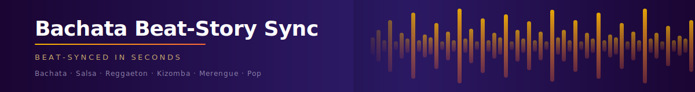

# Marketing Strategy: Bachata Beat-Story Sync

> Unified marketing strategy synthesised from competitive analysis, messaging framework, and landing page planning.

---

## Contents

- [0. Phase 1 Reality](#0-phase-1-reality-current-constraints) ← start here
- [1. Strategic Overview](#1-strategic-overview)
- [2. Target Personas](#2-target-personas)
- [3. Primary Value Proposition](#3-primary-value-proposition)
- [4. Supporting Value Propositions](#4-supporting-value-propositions)
- [5. Messaging Pillars](#5-messaging-pillars)
- [6. Taglines](#6-tagline-options)
- [7. Tone of Voice](#7-tone-of-voice)
- [8. Competitive Landscape](#8-competitive-landscape)
- [9. Landing Page Outline](#9-landing-page-outline)
- [10. Campaign Roadmap](#10-campaign-roadmap)
- [11. Strategic Priorities](#11-strategic-priorities)

---

## 0. Phase 1 Reality (Current Constraints)

> [!WARNING]
> **This section overrides aspirational sections below.** It captures what is true today and should be reviewed first when making any channel or spend decisions.

### Product State

> [!NOTE]
> The tool is **CLI only**. A minimal UI (Streamlit or Gradio wrapper) is planned within days — alpha/beta. Until a UI exists, non-technical users cannot use this tool. Marketing to casual creators before then is premature.

### Audience Right Now

Persona 1 (casual dance creator) and Persona 3 (dance instructor) from §2 **cannot be reached yet.** The critical workflow mismatch:

- Most dance creators film on a phone and upload directly to social — they have no organised clip folder or separate audio WAV file
- This tool requires both — that gap is a **product roadmap problem**, not a marketing problem

**The reachable audience today** is a focused subset of Persona 2:

| Who | Why they fit |
|-----|-------------|
| Dance studios running proper shoots | Multiple takes, organised footage already exists |
| Event videographers (socials, showcases) | Already have clip libraries, edit under time pressure |
| Choreographers assembling rehearsal footage | Repetitive edit task, same structure every time |

### Channel Strategy

| Channel | Role | When |
|---------|------|------|
| **YouTube** | Primary — demo-first, output is the proof | Now |
| **LinkedIn** | Secondary — personal brand cross-posts only | Now |
| TikTok / Reels / paid ads | Full creator audience play | After UI ships |

### Go-to-Market Sequence

1. Build minimal UI wrapper *(days)*
2. Recruit 3–5 beta testers from dance studios or event videography communities
3. Record them using it — that footage **is** the first YouTube content
4. Their output montages **are** the social proof
5. Expand persona targeting once UI removes the technical barrier

### Genre Strategy

> **"Built for bachata. Works for all dance music."**

- Lead with **bachata** — lower competition, passionate community, matches the tool name
- Salsa, reggaeton, kizomba, merengue, pop already supported via genre presets
- Expand through content ("does this work on salsa?"), not product changes

---

## 1. Strategic Overview

**Bachata Beat-Story Sync** occupies a unique, uncontested niche:

> *Beat-aware · Dance-optimised · Batch-ready · Explainable video montage automation*

No direct competitor combines music-structure analysis + motion-intensity matching + genre presets + transparent decision logs in a single local-first tool.

**Core positioning:** "The local-first, genre-aware video montage engine for dance content creators."

---

## 2. Target Personas

### Persona 1 — Dance Content Creator / YouTuber
> *Unlocks after UI ships*

| | |
|---|---|
| **Profile** | Dancers, choreographers, studios publishing to YouTube, TikTok, Instagram. Ages 22–45. |
| **Pain points** | Manual beat-syncing takes hours; hard to publish consistently; professional effects require expensive software. |
| **Goals** | Produce multiple high-quality montages per week; focus on choreography, not editing; generate YouTube Shorts in bulk. |

### Persona 2 — Freelance Video Editor / Production Agency
> *Reachable today (studio/event subset)*

| | |
|---|---|
| **Profile** | Freelancers and post-production studios. Ages 25–50. Deep technical knowledge. |
| **Pain points** | Manual clip selection is repetitive; music-video niche has limited automation tools; client revisions force full re-edits. |
| **Goals** | Reduce editing time 70%+; offer a premium "beat-synced" service; increase project throughput without adding headcount. |

### Persona 3 — Dance Instructor / Studio Manager
> *Unlocks after UI ships*

| | |
|---|---|
| **Profile** | Instructors, event organizers, choreography coaches. Ages 30–55. Low technical skill. |
| **Pain points** | No editing experience; can't afford a video team; current solutions too complex or expensive. |
| **Goals** | Create polished promotional montages from class footage in under 10 minutes; publish consistently without technical bottlenecks. |

---

## 3. Primary Value Proposition

> ### "Automatically sync your dance footage to the beat. Create stunning, professionally-paced montages in minutes, not hours — no editing experience required."

*For professionals:*

> ### "Transform hours of manual editing into minutes. Analyse music, match motion, render studio-quality montages — instantly."

---

## 4. Supporting Value Propositions

### Intelligent Beat & Motion Sync
Every cut lands on the beat. Librosa detects BPM, beats, and musical sections. OpenCV scores each clip's motion intensity and matches it to musical energy. Genre-aware presets (Bachata, Salsa, Reggaeton, Kizomba, Merengue, Pop) ensure authentic pacing — not generic templates.

### Studio-Quality Effects in One Command
Color grading presets (Vintage, Warm, Golden, Cool, B&W), beat-synced visual effects (bloom intros, vignette breathes, light leaks, saturation pulses), audio-reactive waveform visualisers, and cinematic transitions — all applied automatically. Zero manual tweaking.

### 10× Faster Production
A 4-hour Final Cut Pro project takes 4 minutes here. Single command from raw footage to rendered video. Test mode iterates in under 2 minutes. Dry-run previews the full edit plan before committing. Batch YouTube Shorts generates 3–10 vertical clips from one audio track.

---

## 5. Messaging Pillars

| Pillar | Headline | Core Message |
|--------|----------|--------------|
| **Automation** | "No Manual Editing Required" | The AI handles timing, clip selection, grading — you focus on the moves. |
| **Creativity** | "Professional Results, No Training" | Democratises video production for non-editors and supercharges professionals. |
| **Speed** | "Minutes, Not Hours" | Publish 10 videos/week instead of 2. Scale without hiring editors. |
| **Sync Accuracy** | "Every Cut Lands on the Beat" | Music-genre-aware detection makes edits *feel* musical, not arbitrary. |

---

## 6. Tagline Options

| # | Tagline | Tone | Best for |
|---|---------|------|---------|
| 1 | **"Beat-Synced in Seconds"** | Punchy, fast | Social / top-of-funnel ✦ recommended |
| 2 | **"Auto-Edit Your Moves"** | Casual, creator | TikTok / Reels |
| 3 | **"Let the Music Edit for You"** | Poetic | YouTube thumbnails |
| 4 | **"Sync, Grade, Done"** | Efficient, pro | Agency / B2B |
| 5 | **"Professional Montages. Zero Editing."** | Direct | Landing page / LinkedIn |

> **Phase 1 recommendation:** *"Beat-Synced in Seconds"* for YouTube; *"Professional Montages. Zero Editing."* for the studio/agency audience.

---

## 7. Tone of Voice

**Voice attributes:** Confident but approachable · Playful but professional · Clarity over cleverness · Action-oriented

| Do | Don't |
|----|-------|
| "Turn 2 hours of editing into 5 minutes." | "Utilise advanced signal processing algorithms." |
| "Let the AI handle the timing. You handle the moves." | "Leverage OpenCV-based motion-intensity scoring matrices." |
| "Go from raw footage to YouTube-ready in one command." | "Best-in-class video production automation solution." |

**By channel:**

- **YouTube:** Demo-led. Show the output first, explain second. Hook in 15 seconds.
- **Social (TikTok/Reels/Shorts):** Playful, energetic. Hook: "I edited this in 5 minutes. Here's how."
- **Landing page:** Bold claims + specific feature proof. Screenshots with render times.
- **Email/Sales:** Benefit-first. Lead with time saved. Proof second.
- **Docs:** Clear, instructional, technically accurate.

---

## 8. Competitive Landscape

| Competitor | Primary Weakness | Our Advantage |
|------------|-----------------|---------------|
| Runway / Pika | AI *generation* (not editing); cloud-only; no music structure awareness | Local-first; edits *your* footage; beat-aware; free to run |
| Descript | Speech/transcript-driven; slow for music-only content; $15–40/mo | Music-first; no transcription needed; faster iteration |
| CapCut | Mobile/Web UI; manual pacing; no batch automation; no genre presets | CLI batching; 6 genre presets; transparent decisions; local data |
| Adobe Premiere + AI | $55/mo subscription; manual everything; designed for pros | Free/local; fully automated; creator-friendly; explainable |
| FFmpeg (DIY) | Steep learning curve; no music analysis; no clip selection logic | Abstracts FFmpeg entirely; adds intelligent matching; beautiful output |

### Positioning Angles

1. **"The Beat Interpreter for Dance Content Creators"** — Musical section detection mirrors actual choreography structure.
2. **"Local-First, Explainable, Batch-Ready"** — No API costs; full audit trail; Docker-deployable for agencies.
3. **"Latin & Dance Music Specialist"** — 6 pre-tuned genre presets. `--genre bachata` + your clips = professional montage.
4. **"The Explainable AI Editor"** — `--explain` flag generates a markdown audit trail of every clip decision.
5. **"YouTube Shorts Factory"** — 10 unique 9:16 Shorts from one audio track + clip library in minutes.

---

## 9. Landing Page Outline

### Hero
- **Headline:** "Sync Your Dance Videos to Every Beat Automatically"
- **Subheadline:** "AI video editing that analyses Bachata music and matches your dance clips to the rhythm — polished montages in minutes, not hours."
- **CTA:** "Try Free Demo" / "Start Creating Now"
- **Visual:** Split-screen — waveform on left, beat-synced montage on right. Animated beat pulses triggering clip transitions.

### Problem (4 points)
1. Manual editing is tedious — hours of grunt work, deep software knowledge required.
2. Beats are hard to match by ear — misaligned cuts create jarring, unprofessional results.
3. Consistency is elusive — different clip energy levels require different pacing strategies.
4. Existing tools ignore dance — auto-edit tools focus on generic content, not music-driven storytelling.

### How It Works

| Step | Name | What happens |
|------|------|-------------|
| 1 | **Analyse & Learn** | Upload audio + clip folder. Detects BPM, beats, musical sections, motion-intensity scores. No setup. |
| 2 | **Sync & Sequence** | Matches high-energy clips to energetic sections; sequences to 4-beat bar durations; applies speed ramping and B-roll. |
| 3 | **Render & Export** | Outputs 720p H.264 video with synced audio. Optional: Excel analysis report, YouTube Shorts batch. |

### Features

| Feature | Description |
|---------|-------------|
| Beat-Perfect Synchronisation | Librosa detects BPM and beat onsets; clips snap to beat boundaries for musically intentional cuts. |
| Motion-Intensity Matching | OpenCV scores each clip; high-energy clips hit energetic peaks; graceful moments get slow-motion treatment. |
| Intelligent Clip Selection | Forced ordering by filename prefix lets you choreograph key sequences; engine fills gaps dynamically. |
| Professional Visual Effects | Color grading presets, beat-synced visualisers, Ken Burns zoom, saturation pulses, light leaks, vignette — zero manual work. |
| B-Roll & Narrative Flow | Automatically inserts background footage at natural intervals for cinematic depth. Fully configurable. |
| Explainability & Planning | Dry-run previews the full edit plan. Decision logs explain exactly why each clip was chosen, with intensity scores and timing. |

### Social Proof *(to collect)*
YouTube creator testimonials (with subscriber counts) · Dance studio case studies (time saved + engagement lift) · Music producer quotes · Aggregate stats ("1,000+ montages created | Avg. 5 hours saved per video")

### Pricing

| Tier | Price | Key Limits | Best For |
|------|-------|------------|----------|
| **Starter** | Free | 5 montages/mo, 30 min output | Individuals trying the tool |
| **Creator** | $19/mo | Unlimited montages, 500 min output | Active content creators |
| **Studio** | $49/mo | Unlimited everything + API access | Agencies, teams, power users |

*14-day free trial. No credit card required.*

### FAQ

**What formats are supported?**
Audio: `.wav`, `.mp3` · Video: `.mp4`, `.mov`, `.avi`, `.mkv`

**How long does rendering take?**
A 60-second montage with 15–20 clips: ~2–5 minutes on a modern machine.

**Can I control which clips appear at specific moments?**
Yes — name files with numeric prefixes (`1_intro.mp4`, `2_bridge.mp4`). Use dry-run to preview.

**What if my audio is long or my library is huge?**
Use `--max-clips` and `--max-duration` flags; batch processing on Creator/Studio plans.

**Can I export to TikTok/Instagram/YouTube?**
Output is standard 720p H.264 MP4. Creator/Studio plans include a Shorts generator for 9:16 vertical cuts.

### Footer CTA
**"Ready to Stop Manual Video Editing?"** — Create Your First Montage — Free · View Documentation

---

## 10. Campaign Roadmap

| Quarter | Theme | Audience Focus | Primary Channel |
|---------|-------|----------------|----------------|
| **Q2 2026** | "Your Moves. The AI's Timing." | Studios, event videographers — early adopters | YouTube |
| **Q3 2026** | "4 Hours → 4 Minutes." | Editor/agency efficiency, margins, service differentiation | LinkedIn, freelancer communities |
| **Q4 2026** | "Every Beat Counts." | Broad creator audience, genre depth, community proof | Dance forums, Latin music platforms |

---

## 11. Strategic Priorities

1. **Nail the studio/event creator persona first.** Build testimonials with videographers who already have organised clip libraries. Show before/after with specific track examples.
2. **Market explainability as a trust feature.** In an era of AI scepticism, the `--explain` flag is a rare differentiator — lead with it in professional/agency channels.
3. **Benchmark and publish speed data.** "10 YouTube Shorts in 5 minutes vs. CapCut's 30 minutes per Short." Quantify the savings.
4. **Build a community preset library.** Allow creators to contribute genre presets (Brazilian Funk, K-pop, Ballroom). Open-source + community = stickiness and SEO.
5. **Target subscription fatigue.** "No recurring cost. Own your data. Run offline." Resonates strongly against $15–55/mo tool fatigue.
6. **Plan API/SDK for agencies.** Wrap the Python CLI in a REST API. Studios want to white-label and integrate — this unlocks a high-value B2B channel.
