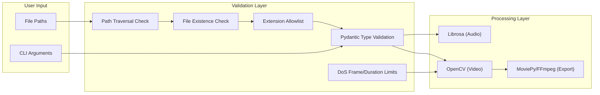

# Security Overview — Bachata Beat-Story Sync

> Summary of the project's security posture, implemented mitigations, and known risks.

---

## Security Architecture



---

## Implemented Mitigations

### 1. Path Traversal Prevention

**Location:** [validation.py](file:///Users/tutorsam/Documents/Business/YouTube/01_BBB/_software/bachata-beat-story-sync/src/core/validation.py)

The `validate_file_path()` function rejects any path containing `..`:

```python
if ".." in path:
    raise ValueError("Path traversal attempt detected")
```

**Scope:** Applied to all audio and video file inputs via Pydantic `field_validator`.

---

### 2. File Extension Allowlisting

**Location:** [audio_analyzer.py](file:///Users/tutorsam/Documents/Business/YouTube/01_BBB/_software/bachata-beat-story-sync/src/core/audio_analyzer.py), [video_analyzer.py](file:///Users/tutorsam/Documents/Business/YouTube/01_BBB/_software/bachata-beat-story-sync/src/core/video_analyzer.py)

Only pre-approved file extensions are accepted:

| Type | Allowed Extensions |
|------|-------------------|
| Audio | `.wav`, `.mp3` |
| Video | `.mp4`, `.mov`, `.avi`, `.mkv` |

Any file with an unlisted extension is rejected at the validation layer.

---

### 3. Denial-of-Service Protection

**Location:** [video_analyzer.py](file:///Users/tutorsam/Documents/Business/YouTube/01_BBB/_software/bachata-beat-story-sync/src/core/video_analyzer.py)

The video analyzer enforces resource limits to prevent malicious or excessively large files from consuming resources:

| Limit | Value | Rationale |
|-------|-------|-----------|
| Max frames | 100,000 | ~56 minutes at 30fps |
| Max duration | 3,600 seconds | 1 hour cap |

Videos exceeding either limit raise a `ValueError` before processing begins.

---

### 4. Input Validation via Pydantic

**Location:** All input models (`AudioAnalysisInput`, `VideoAnalysisInput`)

All external inputs are validated through Pydantic `BaseModel` subclasses before reaching business logic:
- **Type checking** — fields must match expected types
- **Custom validators** — `@field_validator` runs security checks
- **Fail-fast** — `ValidationError` raised immediately on invalid input

---

### 5. Secrets Management

| Item | Status |
|------|--------|
| `.env` file gitignored | ✅ Yes |
| `.env.example` template provided | ✅ Yes |
| No hardcoded secrets in source | ✅ Verified |
| API keys (Gemini) referenced but not yet used | ⚠️ Future concern |

---

## Known Risks & Recommendations

### Open Risks

| Risk | Severity | Description | Recommendation |
|------|----------|-------------|----------------|
| **Media file content parsing** | 🟡 Medium | FFmpeg/OpenCV parse untrusted media files which could exploit codec vulnerabilities | Run processing in a sandboxed environment for untrusted inputs |
| **No rate limiting** | 🟢 Low | Processing large video libraries consumes unbounded CPU/memory | Add a `--max-clips` flag or batch processing with limits |
| **Unpinned dependencies** | 🟡 Medium | `requirements.txt` uses `>=` without upper bounds | Pin versions (e.g., `librosa>=0.9.0,<1.0`) or use `pip freeze` |
| **No authentication** | 🟢 Low | CLI tool runs with user's full permissions | Acceptable for local-only tool; reconsider if exposed as service |
| **Symlink resolution** | 🟢 Low | Path traversal check looks for `..` but doesn't resolve symlinks | Add `os.path.realpath()` before validation |

### Reporting Security Issues

If you discover a security vulnerability, please **do not** open a public issue. Instead:

1. Email the project maintainer directly
2. Include a description of the vulnerability and steps to reproduce
3. Allow reasonable time for a fix before disclosure
