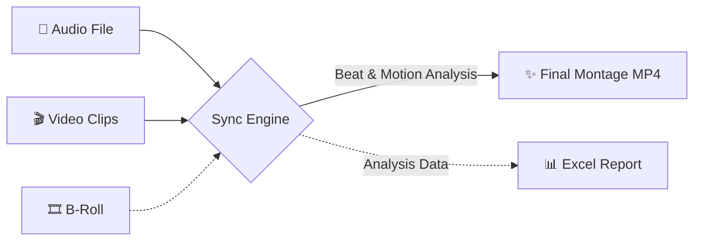
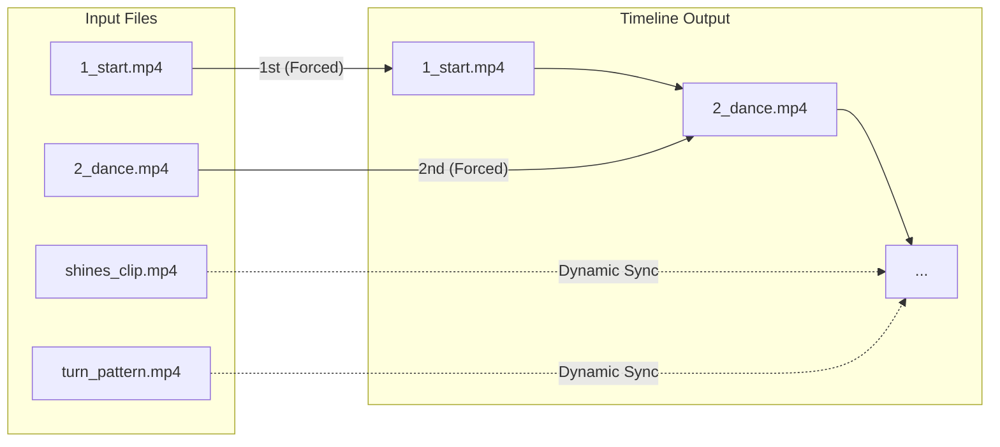
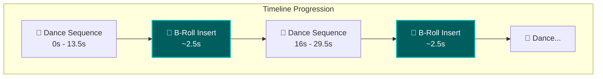
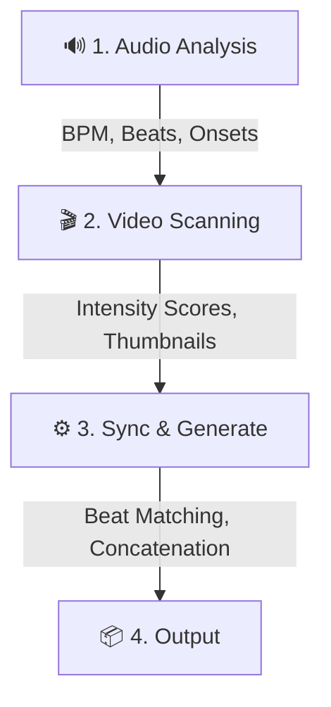

# User Guide — Bachata Beat-Story Sync

> Automatically sync your Bachata dance video clips to music and create stunning montages.

---

## 🌟 High-Level Overview

Bachata Beat-Story Sync is an intelligent video editing assistant. It listens to your music, watches your dance clips, and mathematically matches the energy of your dancing to the rhythm of the song. 



---

## ⚙️ Prerequisites

Before you begin, make sure you have:

| Requirement | Minimum Version | Check Command |
|-------------|----------------|---------------|
| **Python** | 3.9+ | `python3 --version` |
| **pip** | Latest | `pip --version` |
| **ffmpeg** | 4.0+ | `ffmpeg -version` |
| **Git** | Any | `git --version` |

> [!IMPORTANT]
> **ffmpeg** is required for video/audio processing. Install it:
> - **macOS**: `brew install ffmpeg`
> - **Ubuntu/Debian**: `sudo apt install ffmpeg`
> - **Windows**: Download from [ffmpeg.org](https://ffmpeg.org/download.html)

---

## 💿 Installation

```bash
# 1. Clone the repository
git clone <repo-url>
cd bachata-beat-story-sync

# 2. Create virtual environment and install dependencies
make install

# 3. (Optional) Copy and configure environment
cp .env.example .env
```

---

## 🚀 Quick Start

The simplest usage requires just an audio file and a folder of video clips:

```bash
# Activate the virtual environment
source venv/bin/activate

# Run the tool
python main.py --audio my_bachata_track.wav --video-dir ./my_clips/
```

This produces `output_story.mp4` in the current directory.

---

## 🎛️ CLI Reference

```
python main.py [OPTIONS]
```

| Flag | Required | Default | Description |
|------|----------|---------|-------------|
| `--audio PATH` | ✅ Yes | — | Path to input audio file (`.wav` or `.mp3`) |
| `--video-dir PATH` | ✅ Yes | — | Directory containing video clips (`.mp4`, `.mov`, `.avi`, `.mkv`) |
| `--broll-dir PATH` | No | `video-dir/broll` | Optional directory for B-roll clips |
| `--output PATH` | No | `output_story.mp4` | Output video file path |
| `--export-report PATH` | No | — | Export an Excel analysis report (`.xlsx`) |
| `--test-mode` | No | `False` | Run in test mode (max 4 clips, 10s of music) |
| `--max-clips INT` | No | — | Maximum number of clip segments (overrides test-mode) |
| `--max-duration FLOAT` | No | — | Maximum montage duration in seconds (overrides test-mode) |
| `--version` | No | — | Show version and exit |

### Examples

```bash
# Basic montage
python main.py --audio song.wav --video-dir ./clips/

# Custom output path
python main.py --audio song.wav --video-dir ./clips/ --output my_montage.mp4

# With Excel report
python main.py --audio song.wav --video-dir ./clips/ --export-report analysis.xlsx

# With explicit B-roll directory
python main.py --audio song.wav --video-dir ./clips/ --broll-dir ./broll/

# Test mode for rapid iteration
python main.py --audio song.wav --video-dir ./clips/ --test-mode
```

---

## ✨ Advanced Features

### 1️⃣ Forced Clip Ordering

You can force specific clips to appear at the beginning of the montage by prepending their filenames with a number and an underscore (e.g., `1_start.mp4`, `2_dance.mp4`). The sync engine will prioritise these clips in exact sequence before falling back to dynamic intensity-based matching for the remainder of the clips.



### 🎥 B-roll Insertion

The system can periodically inject clips from a dedicated B-roll library to add narrative flair and break up the dancing sequences (configured by default to roughly every 13.5 seconds).  

You can use B-roll by:
1. Placing a folder simply named `broll` directly inside your `--video-dir`. It will be automatically detected.
2. Providing an explicit B-roll folder path using the `--broll-dir` CLI argument.



### 🐢 Smooth Slow-Motion

For low-intensity musical passages, the sync engine may slow down clips to match the mood. Rather than duplicating frames (which looks choppy), the tool uses FFmpeg's advanced frame blending (`minterpolate`) to synthetically interpolate new frames, ensuring smooth visual fluidity.

```mermaid
flowchart LR
    subgraph ❌ Standard Slow Motion (Choppy)
    direction LR
    A1[Frame 1] --> A1_dup[Frame 1] --> A2[Frame 2] --> A2_dup[Frame 2]
    end
    
    subgraph ✅ Smooth Interpolation
    direction LR
    B1[Frame 1] --> B_new[✨ Blended Frame] --> B2[Frame 2] --> B_new2[✨ Blended Frame]
    end

    style B_new fill:#4a3200,stroke:#cca300,stroke-width:2px,stroke-dasharray: 5 5,color:#fff
    style B_new2 fill:#4a3200,stroke:#cca300,stroke-width:2px,stroke-dasharray: 5 5,color:#fff
```

---

## 📁 Supported File Formats

### Audio
| Format | Extension |
|--------|-----------|
| WAV | `.wav` |
| MP3 | `.mp3` |

### Video
| Format | Extension |
|--------|-----------|
| MPEG-4 | `.mp4` |
| QuickTime | `.mov` |
| AVI | `.avi` |
| Matroska | `.mkv` |

---

## 🧠 How It Works

The tool follows a 4-step pipeline:



1. **Audio Analysis** — Detects BPM, beat positions, and onset times in your Bachata track
2. **Video Scanning** — Scans your clip library and calculates a motion-intensity score for each clip
3. **Sync & Generate** — Selects and trims clips to 4-beat bar durations, then stitches them together
4. **Output** — Writes the final MP4 (720p, H.264, AAC audio) and optionally exports an Excel analysis report

---

## 📊 Understanding the Excel Report

When using `--export-report`, the tool generates a 3-sheet Excel workbook:

| Sheet | Contents |
|-------|----------|
| **Analysis Summary** | Audio file name, BPM, duration, peak count, sections |
| **Video Library** | File paths, durations, intensity scores, thumbnails |
| **Visualizations** | Bar chart of intensity score distribution |

The intensity score column uses a **color scale** (red → yellow → green) to help you visually identify high-energy vs. low-energy clips.

---

## 🛠️ Troubleshooting

### "File not found" error
- Ensure your audio/video paths are correct and accessible
- Use absolute paths if relative paths cause issues

### "Unsupported extension" error
- Check that your files use one of the supported formats listed above
- The tool checks file extensions, not content — rename files if needed

### "Path traversal attempt detected"
- File paths cannot contain `..` for security reasons
- Use absolute or forward-relative paths only

### No output generated
- Ensure your video clips are **longer than ~2 seconds** (shorter clips are skipped)
- Make sure FFmpeg is installed and accessible in your `PATH`

### Low quality output
- Provide higher-resolution source clips (the tool standardizes to 720p)
- The tool uses `ultrafast` preset for speed — quality is prioritized for iteration speed

---

## 💡 Tips for Best Results

1. **Prepare your clips** — Use clips that are at least 3–5 seconds long
2. **Organize by energy** — The tool auto-scores intensity, but having a mix of high/low energy clips produces better results
3. **Use clean audio** — Higher quality audio files produce more accurate beat detection
4. **Start small** — Test with 5–10 clips before processing a large library
